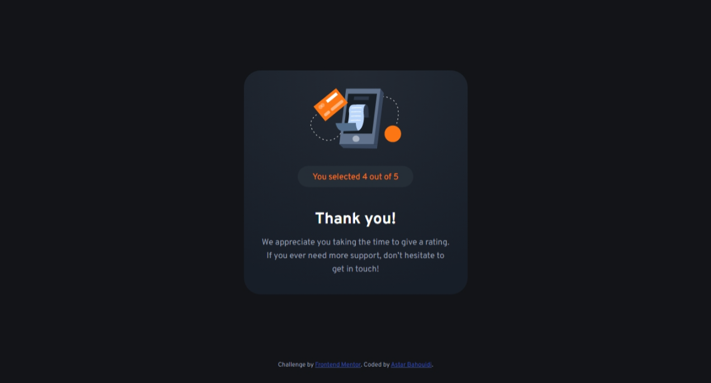

# Frontend Mentor - Interactive rating component solution

This is a solution to the [Interactive rating component challenge on Frontend Mentor](https://www.frontendmentor.io/challenges/interactive-rating-component-koxpeBUmI). Frontend Mentor challenges help you improve your coding skills by building realistic projects.

## Table of contents

- [Frontend Mentor - Interactive rating component solution](#frontend-mentor---interactive-rating-component-solution)
  - [Table of contents](#table-of-contents)
  - [Overview](#overview)
    - [The challenge](#the-challenge)
    - [Screenshot](#screenshot)
    - [Links](#links)
  - [My process](#my-process)
    - [Built with](#built-with)
    - [Continued development](#continued-development)
  - [Author](#author)

## Overview

### The challenge

Users should be able to:

- [x]  View the optimal layout for the app depending on their device's screen size
- [x] See hover states for all interactive elements on the page
- [x] Select and submit a number rating
- [x] See the "Thank you" card state after submitting a rating

### Screenshot

### Links

- Solution URL: [Beautiful Rating Component](https://www.frontendmentor.io/solutions/beautiful-rating-component-jvdPFFJJfj)
- Live site: [Interactive Rating Component](https://matondo99.github.io/interactive-rating-component/)

## My process

### Built with

- Semantic HTML5 markup
- CSS custom properties
- Flexbox
- Mobile-first workflow
- Vanilla Javascript

### Continued development

Feel like the way I use `input` element in my script expose the page to *cross-site scripting* attack.

>:warning: **WARNING:**
>
>When using these HTML APIs, it is very important that you never insert user input into the document. If you do this, you allow malicious users to inject their own scripts into your application. See “Cross-site scripting” for details.
>
>*Flanagan, David. JavaScript: The Definitive Guide (p. 447). O'Reilly Media.*

## Author

- Website - [Astar Bahouidi](https://github.com/Matondo99)
- Frontend Mentor - [@Matondo99](https://www.frontendmentor.io/profile/Matondo99)
